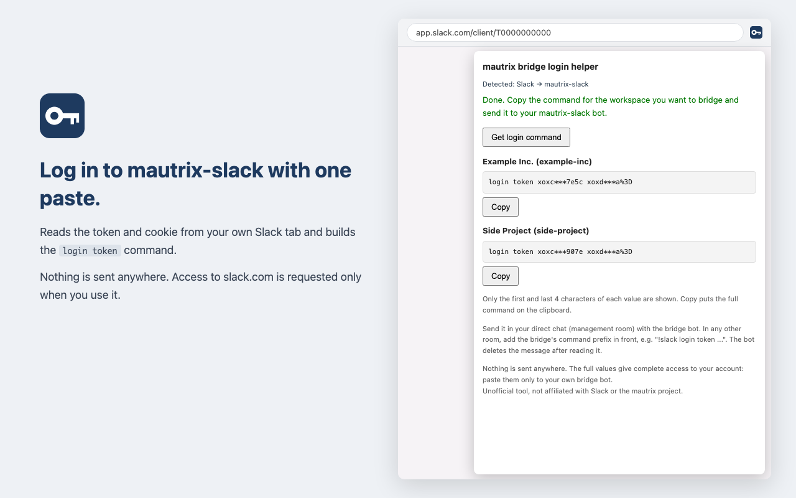

# Login Helper for mautrix bridges

[日本語](#日本語)

An unofficial Chrome / Edge extension that reads **your own** login credentials from a tab you are
signed in to, and builds the login command for a [mautrix](https://github.com/mautrix) bridge.
Tokens are never shown in full: the popup shows only their first and last 4 characters, and
the full command goes only to the clipboard. **Nothing is sent anywhere.**



## Supported bridges

| Service | Bridge | Command it builds |
|---|---|---|
| Slack | [mautrix-slack](https://github.com/mautrix/slack) | `login token <xoxc token> <d cookie>` (one per signed-in workspace) |

More bridges may be added later (see [Adding a service](#adding-a-service)).

### Why for Slack

mautrix-slack's token login needs the `xoxc-` token from the web app's local storage and the
`d` cookie, which is HttpOnly and cannot be read from the page or the console. Getting both
normally means digging through the browser's developer tools. The bridge also offers password
login, but it may require a CAPTCHA, which does not work with bot commands; the bridge's changelog
still recommends manual token login.

## Install

- Chrome Web Store: _link will be added after review_
- Microsoft Edge: open the Chrome Web Store link, choose **Allow extensions from other stores**, then
  **Get**.

## Usage

1. Open Slack in the browser (`https://app.slack.com`) and sign in.
2. Click the extension icon, then **Get login command**.
3. The first time, Chrome asks for access to `slack.com`. Choose **Allow**. If the popup closes
   when the prompt appears, click the icon and the button again.
4. Copy the command for the workspace you want and send it to your mautrix-slack bot in your
   direct chat (management room) with it. In other rooms, add the bridge's command prefix, e.g.
   `!slack login token ...`. The bot deletes the message after reading it.

The popup shows the command masked (`login token xoxc***1a2b xoxd***3c4d`). **Copy** puts the
full command on the clipboard; there is no way to display it in full, so it does not end up in
screenshots or screen shares. If copying fails, the popup says so instead of revealing the value.

The command gives full access to your Slack account. Never paste it anywhere except your own
bridge bot.

## Permissions

| Permission | Why |
|---|---|
| `activeTab`, `scripting` | Read the Slack web app's local storage (`localConfig_v2`) in the tab you clicked the icon on, to get the `xoxc-` token |
| `cookies` | Read the `d` cookie, which is HttpOnly |
| `https://*.slack.com/*` (optional) | Needed by the `cookies` API. Requested at runtime the first time you use it, not at install |

No network requests are made, no data is stored, and there is no analytics. See
[PRIVACY.md](PRIVACY.md).

## Development

```bash
# Load unpacked: chrome://extensions → Developer mode → Load unpacked → extension/
./build.sh                     # checks + dist/mautrix-login-helper-<version>.zip for the store
node tests/test-popup.mjs      # unit tests + the real popup in headless Chrome (no token on screen)
python3 tools/screenshot.py    # store/images/*.png (needs Google Chrome)
python3 tools/make-icons.py    # extension/icons/*.png (needs Pillow)
```

### Adding a service

1. Add an entry to `SERVICES` in `extension/services.js`. Follow the field IDs and order of the
   bridge's cookie login step (`LoginStepTypeCookies` in the bridge's `pkg/connector/login*.go`).
2. Add the service's origins to `optional_host_permissions` in `extension/manifest.json`. Keep
   them optional so existing users are not asked to re-approve the extension on update.
3. List every credential inside a step's `text` in its `secrets`. The popup masks exactly
   those values; anything not listed would be shown in full.
4. Add `<id>_ok` and error messages to every `extension/_locales/*/messages.json`.
5. Run `./build.sh` (fails if origins or locale keys do not match) and `node tests/test-popup.mjs`.

Only add services whose bridge accepts the credentials through bot commands and whose values can
be read with the permissions above. Bridges that need captured request headers (e.g. LinkedIn, X)
would require `webRequest`, which is out of scope.

## Disclaimer

Not affiliated with, endorsed by, or sponsored by Slack Technologies or the mautrix project.
Using your own session token may be restricted by the service's terms. Use at your own risk.

## License

[MIT](LICENSE)

---

## 日本語

開いていてサインイン済みのタブから**自分の**ログイン情報を読み取り、
[mautrix](https://github.com/mautrix) ブリッジのログインコマンドを組み立てる、非公式の Chrome / Edge 拡張です。
トークンは画面に全体を表示しません。先頭と末尾の4文字だけを出し、伏せていないコマンドはクリップボードにだけ入ります。**外部には何も送信しません。**

### 対応ブリッジ

| サービス | ブリッジ | 組み立てるコマンド |
|---|---|---|
| Slack | mautrix-slack | `login token <xoxc トークン> <d Cookie>`（サインイン中のワークスペースごと） |

### 使い方

1. ブラウザで Slack（`https://app.slack.com`）を開き、サインインする
2. 拡張のアイコンを押し、「ログインコマンドを取得」を押す
3. 初回だけ `slack.com` へのアクセス許可を求められるので「許可」を選ぶ。許可の画面が出たときにポップアップが閉じた場合は、もう一度アイコンとボタンを押す
4. つなぎたいワークスペースのコマンドをコピーし、mautrix-slack の bot とのダイレクトチャット（管理ルーム）に送る。
   それ以外のルームでは `!slack login token ...` のようにコマンド接頭辞を付ける。bot は読み取ったあとメッセージを削除する

画面には `login token xoxc***1a2b xoxd***3c4d` のように伏せて表示します。「コピー」を押すと伏せていないコマンドがクリップボードに入ります。
全体を表示する手段はないので、スクリーンショットや画面共有に写りません。コピーに失敗したときも値は表示せず、失敗したことだけを伝えます。

コマンドは Slack アカウントそのものと同じ権限を持ちます。自分のブリッジ bot 以外には絶対に貼り付けないでください。

Edge では、Chrome ウェブストアのページで「他のストアからの拡張機能を許可」を選んでから「入手」を押します。

権限の用途とプライバシーについては上の [Permissions](#permissions) と [PRIVACY.md](PRIVACY.md) を参照してください。
